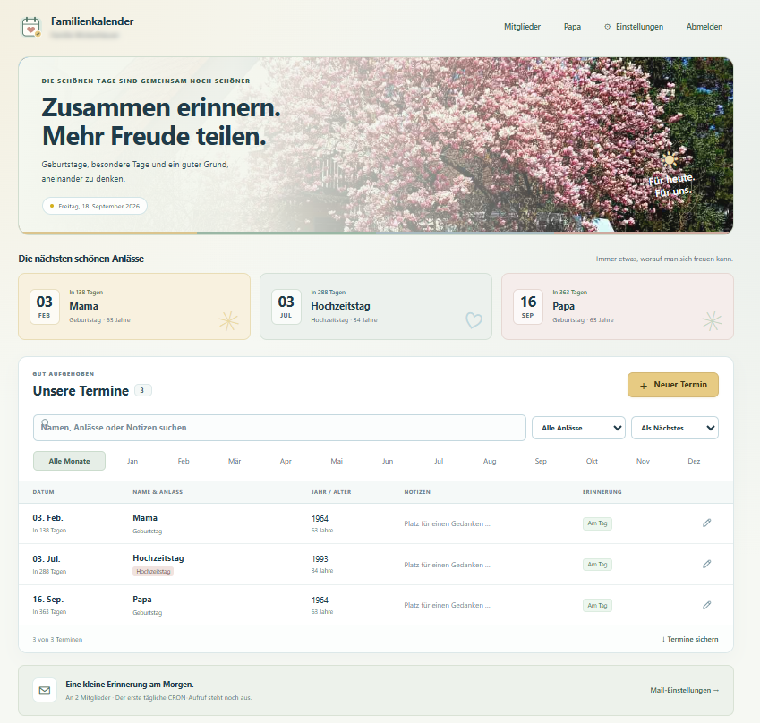

# Familienkalender

Gemeinsamer Kalender für Geburtstage, Hochzeitstage und andere Anlässe – mit eigenen Konten, gleichen Rechten für alle und täglichen Erinnerungen per Mail. Termine lassen sich suchen, bearbeiten und als JSON exportieren.



## Neue Mitglieder einladen

Ein bestehendes Mitglied öffnet **Mitglieder**, trägt Name und Mailadresse ein und bestätigt mit seinem eigenen Passwort. Das neue Mitglied erhält eine Einladungsmail; bei Bedarf lässt sie sich im Mitgliederfenster erneut senden.

So richtet das eingeladene Mitglied seinen Zugang ein:

1. **Seite öffnen:** Den Link aus der Einladungsmail aufrufen.
2. **Zugang eingeben:** Die eigene Mailadresse und das Startpasswort aus der Mail eintragen, normalerweise `familienkalender`.
3. **Einrichtungscode einsetzen:** **Erste Anmeldung auf dem Server?** aufklappen und den vollständigen privaten Einrichtungscode aus der Mail in **Privater Einrichtungscode** kopieren. Gemeint ist die lange Zeichenfolge (z. B. 32 Hex-Zeichen; die Länge kann abweichen), für die `DEIN_PRIVATER_EINRICHTUNGSCODE` als Platzhalter steht. Dann **Kalender öffnen** wählen.
4. **Eigenes Passwort wählen:** Unter **Bisheriges Startpasswort** nochmals das Passwort aus Schritt 2 eingeben. Ein neues Passwort mit mindestens 10 Zeichen wählen, wiederholen und mit **Passwort festlegen & starten** speichern.
5. **Fertig:** Du bist jetzt Vollmitglied mit allen Rechten und kannst Termine, Mitglieder und gemeinsame Einstellungen verwalten. Künftig reichen Mailadresse und eigenes Passwort.

Der Einrichtungscode ist nicht der achtstellige Reset-Code für **Passwort vergessen?**.

## Installation

Voraussetzungen: **PHP 8.1+ auf einem 64-Bit-System**, Apache, JavaScript und ein für PHP `mail()` eingerichteter Maildienst. Keine Datenbank und kein Build nötig. Alle Betriebsdateien liegen in **`src/`**.

1. `src/config.example.php` nach `src/config.php` kopieren. Gruppennamen, Absender, `base_url` und die Konten unter `initial_members` anpassen; ein Hintergrundbild ist optional.
2. Einen privaten Einrichtungscode erzeugen und als `setup_key` eintragen:

   ```sh
   php -r "echo bin2hex(random_bytes(24)), PHP_EOL;"
   ```

3. Für tägliche Erinnerungen `mail_enabled` auf `true` setzen und PHP Schreibrechte auf `src/data/` geben.
4. Den Inhalt von `src/` einschließlich aller `.htaccess`-Dateien und der privaten `config.php` auf den Webserver kopieren. HTTPS verwenden. Apache muss die `.htaccess`-Regeln auswerten; bei Nginx entsprechende Zugriffssperren einrichten. `config.php`, `data/` und `lib/` dürfen nicht öffentlich abrufbar sein.
5. Webseite öffnen: Konten und Beispieltermine werden automatisch angelegt. Mit einem konfigurierten Konto, Startpasswort und Einrichtungscode anmelden und ein eigenes Passwort setzen. Direkt über `localhost` entfällt der Einrichtungscode.

Lokal mit XAMPP beispielsweise `http://localhost/familienkalender/src/` öffnen. `initial_members`, `timezone` und `mail_enabled` werden nur beim ersten Anlegen von `data/setup.json` übernommen; spätere Änderungen erfolgen in der Oberfläche.

## Erinnerungen per Cron

Täglich um 07:00 Uhr ausführen (Serverpfad anpassen; Zeitzone von Scheduler und Kalender auf `Europe/Berlin` abstimmen):

```cron
0 7 * * * /usr/bin/php /var/www/familienkalender/cron.php >> /var/log/familienkalender.log 2>&1
```

Der ausführende Benutzer benötigt Lese- und Schreibrechte auf `data/`. Alternativ kann ein HTTPS-Cron-Dienst wie Cron-Light täglich diese URL aufrufen:

```text
https://kalender.example.org/cron.php?setup_key=DEIN_PRIVATER_EINRICHTUNGSCODE
```

Den Platzhalter durch den privaten `setup_key` ersetzen. Ohne gültigen Code antwortet der Endpunkt mit HTTP 403. Die URL geheim halten; wegen möglicher URL-Protokolle ist PHP-CLI-Cron vorzuziehen.

Pro Aufruf schreibt `cron.php` einen Eintrag in `data/cron.log`, welches wenn > 50 KiB zu `data/cron_old.log` rotiert wird.

Jedes Mitglied erhält eine eigene Sammelmail mit den fälligen Erinnerungen. Erfolgreiche Sendungen werden protokolliert; erneute Aufrufe wiederholen nur offene Sendungen. Ausgefallene Tage werden nicht nachgeholt. Eine Testmail lässt sich unter **Einstellungen → Testmail an mich senden** auslösen.

Versandvorschau ohne echte Mails:

```sh
php src/cron.php --dry-run
php src/cron.php --dry-run --date=2027-02-03
```

## Daten, Updates und Tests

`src/config.php`, Laufzeitdaten unter `src/data/` und private Bilder gehören nicht ins öffentliche Repository. `.gitignore` enthält dafür Regeln. Regelmäßig `config.php` und `data/` sichern und bei Updates erhalten; der JSON-Export sichert nur Termine.

```sh
php tests/run.php
python tests/integration.py --base-url http://localhost/familienkalender/
```

Die Tests verwenden isolierte Daten und simulierten Mailversand. Die HTTP-Tests benötigen Apache unter der angegebenen Projektadresse.

## Lizenz

[MIT](LICENSE)
