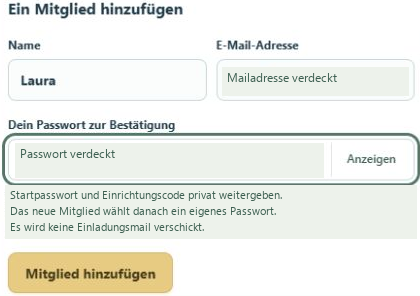
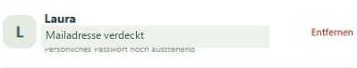
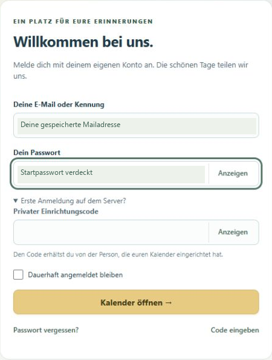
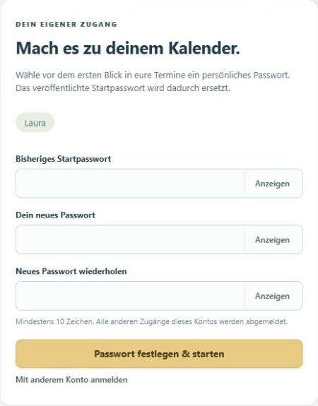
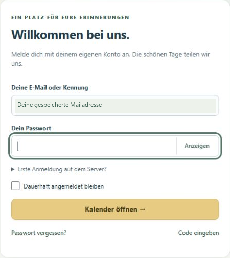
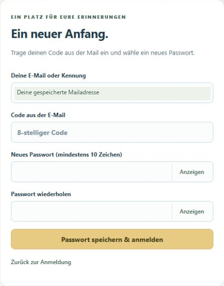

# Willkommen im Familienkalender!

Deine bebilderte Anleitung für die erste Anmeldung - mit privatem Einrichtungscode oder per E-Mail.

**Hier geht’s zum Kalender:** [Familienkalender öffnen](https://flexgate.org/terminkalender/familie_wickenh/)

**Stand:** 18. September 2026. Die Bilder stammen von der Live-Seite. Mailadressen und Zugangsdaten sind verdeckt; Laura ist das Beispielmitglied.

## Schön, dass du dabei bist!

Geburtstage, besondere Tage und ein guter Grund, aneinander zu denken. Mit deinem eigenen Zugang bist du mittendrin.

> **Zuerst aufgenommen werden**
> Eine freie Selbstregistrierung gibt es derzeit nicht. Ein bestehendes Mitglied legt dich zuerst mit Name und Mailadresse an. Der private Einladungs- bzw. Einrichtungscode allein erstellt noch kein Konto.

1. Ein angemeldetes Mitglied öffnet **Mitglieder** und trägt unter **Ein Mitglied hinzufügen** deinen Vornamen und deine Mailadresse ein.
2. Es bestätigt mit **seinem eigenen Passwort** und klickt auf **Mitglied hinzufügen**. Alle Mitglieder haben dieselben Kalender- und Verwaltungsrechte.
3. Danach wählst du einen Weg: **A: Startpasswort + privater Einrichtungscode** (Seite 2) oder **B: Code per E-Mail** (Seite 4).

Beispiel Laura: Die Aufnahme erfolgt durch ein bestehendes Mitglied.

Es wird keine Einladungsmail automatisch verschickt. Startpasswort und Einrichtungscode erhältst du persönlich von der Person, die den Kalender betreut.

## A · Mit Einladungscode starten

Dein Konto wurde angelegt? Dann brauchst du deine hinterlegte Mailadresse, das Startpasswort und den privaten Einrichtungscode.

1. Öffne den Familienkalender und trage deine **Mailadresse** sowie das **Startpasswort** ein.
2. Klappe **Erste Anmeldung auf dem Server?** auf. Trage bei **Privater Einrichtungscode** den persönlich erhaltenen Code ein.
3. Wähle **Kalender öffnen →**. Der nächste Schritt ist dein eigenes Passwort (Seite 3).

Das Zusatzfeld wird über „Erste Anmeldung auf dem Server?“ geöffnet.

Der gemeinsame Einrichtungscode ist nur für die erste Anmeldung eines noch nicht eingerichteten Kontos nötig. Er ist etwas anderes als der achtstellige Code aus einer E-Mail. Zugangsdaten werden in dieser weitergebbaren Anleitung bewusst nicht abgedruckt.

## Dein Passwort. Dein Zugang.

Nach der ersten Anmeldung begrüßt dich der Kalender mit „Mach es zu deinem Kalender.“ Wie im Beispiel darf dein Vorname sichtbar bleiben.

1. Gib unter **Bisheriges Startpasswort** noch einmal dein Startpasswort ein.
2. Wähle ein **eigenes Passwort mit mindestens 10 Zeichen** und wiederhole es. Verwende nicht erneut das gemeinsame Startpasswort.
3. Klicke auf **Passwort festlegen & starten**. Danach kannst du die gemeinsamen Termine öffnen.

Laura ist aufgenommen und angemeldet; hier wählt sie ihr persönliches Passwort.

Später meldest du dich mit deiner hinterlegten Mailadresse und deinem eigenen Passwort an. Eine bekannte Kennung geht ebenfalls; dein Anzeigename muss nicht deine Kennung sein. Auf deinem eigenen Gerät kannst du „Dauerhaft angemeldet bleiben“ wählen.

## B · Lieber per E-Mail?

Auch ohne Startpasswort und Einrichtungscode kannst du deinen Zugang einrichten: mit einem Code an deine bereits hinterlegte Mailadresse. Dein Konto muss vorher angelegt sein.

1. Trage auf der Anmeldeseite zuerst deine **hinterlegte Mailadresse** ein. Das Passwortfeld darf für diesen Weg leer bleiben.
2. Klicke auf **Passwort vergessen?**. Dieser Weg funktioniert auch für die erste persönliche Einrichtung.
3. Öffne dein Postfach und gegebenenfalls den Spamordner. In der Mail steht ein **achtstelliger Code**, der **15 Minuten** lang und **nur einmal** gilt.

„Passwort vergessen?“ startet den E-Mail-Weg; „Code eingeben“ öffnet das Formular.

Die Rückmeldung ist absichtlich allgemein: „Falls ein passendes Konto vorhanden ist …“. Sie beweist nicht, dass eine Mail angekommen ist. Keine Mail? Prüfe Adresse und Spamordner und frage ein bestehendes Mitglied, ob dein Konto mit genau dieser Mailadresse angelegt ist.

## Code rein. Kalender auf!

Zurück im Kalender erscheint das Formular für deinen Mail-Code. Falls nötig, öffnest du es auf der Anmeldeseite über „Code eingeben“.

1. Trage dieselbe **Mailadresse** und den **achtstelligen Code aus der E-Mail** ein.
2. Wähle ein **neues persönliches Passwort mit mindestens 10 Zeichen** und wiederhole es.
3. Klicke auf **Passwort speichern & anmelden**. Dein eigenes Passwort ist gesetzt und du bist angemeldet.

Für diesen Weg brauchst du den E-Mail-Code, nicht den privaten Einrichtungscode.

Code abgelaufen? Fordere über „Passwort vergessen?“ einen neuen an und verwende nur die neueste Mail. Ein neues Passwort beendet andere Zugänge deines Kontos. Nach erfolgreicher Anmeldung: Termine entdecken, Erinnerungen genießen und bei Änderungen deiner Mailadresse dein eigenes Konto öffnen.

---

**Ein kleiner Unterschied, der hilft:** Der private Einrichtungscode gehört zum Weg A. Der achtstellige, zeitlich begrenzte Mail-Code gehört zum Weg B. Beide Wege enden mit deinem eigenen Passwort.

**Schon fertig eingerichtet?** Dann reichen beim nächsten Besuch deine Mailadresse und dein eigenes Passwort. Den privaten Einrichtungscode brauchst du nicht erneut.
